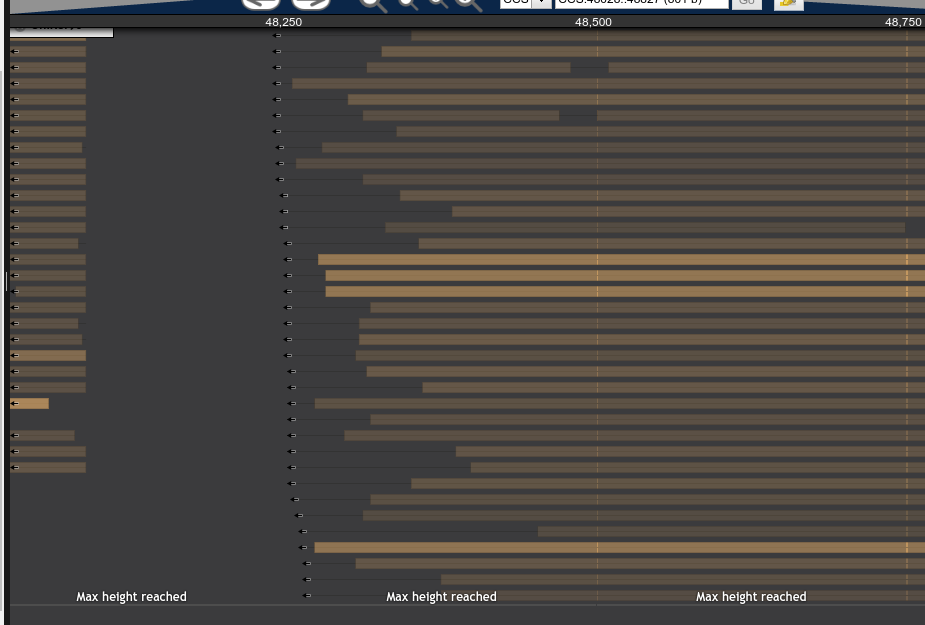
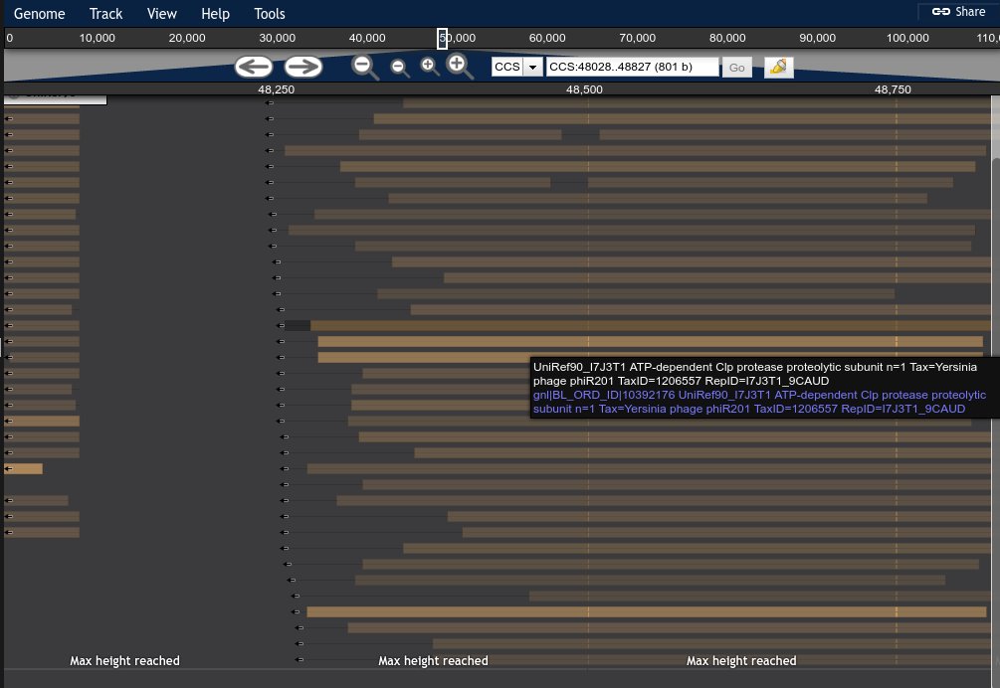
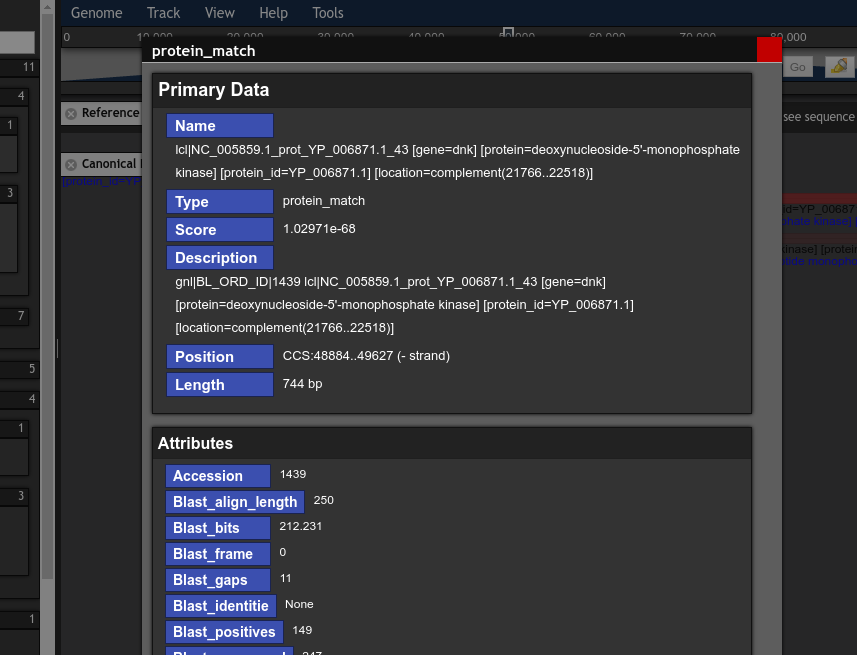

# Dark, Flat Theme for JBrowse

It tries to be coherent around a simple philosophy:

- remove unnecessary ink / graphics
- maintain focus on important data

I've probably over done it a bit with the drop shadows but oh well. Layers are nice, they give depth and context!

## LICENSE

GPL-3?
